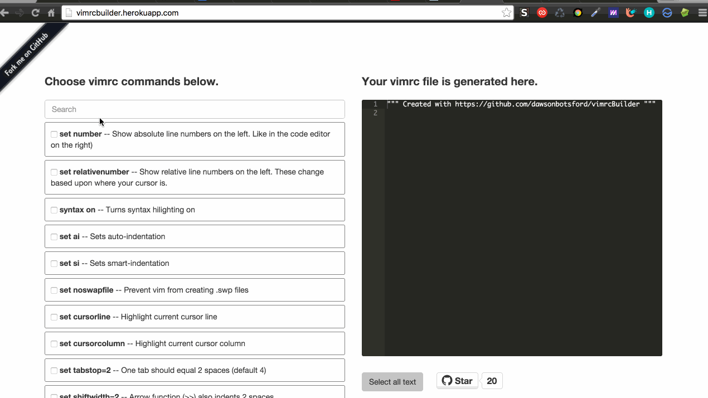

<p align="center">
  <a>
    
  </a>
</p>

<p align="center">
  <br>
  <b>vimrc building made easy</b> via a web app
  <br>
  <br>

  <a href="LICENSE">
    
  </a>

  <a href="https://travis-ci.org/dawsonbotsford/vimrcBuilder">
    
  </a>

  <br>
</p>

<br>
<br>
## Why
Building a vimrc file should not be difficult. **You're configuring a code editor that was invented in 1991** after all. No-matter your experience level, there are always new ways to alter your vim experience, yet finding the commands to do so can be impossible as tips are scattered across the internet.

<p align="center">
  <b>Build a snippet or an entire vimrc with vimrcBuilder</b>
</p>

<br>
Having a vimrc is nearly critical if it's your primary text editor. Certain things should have just been built in, but they are not.

Example: `syntax on` in your vimrc enables syntax hi-lighting

`syntax on` and many more options are available for usage in the live web-app linked below.

<br>
## Usage
Visit the live web-app at [vimrcbuilder.herokuapp.com](https://vimrcbuilder.herokuapp.com)

<br>
## Contributing

####Install
```shell
npm run newb
```
<br>

####HowTo
Edit content in `/src` and build with grunt. Consider leaving a `grunt watch` process in another window during your development.

As grunt builds the `/dist` directory, you will see updates by running `node index.js` from `/` and `open http://localhost:3000` in your browser. LiveReload is not configured, so manual page reloads in browser are required.

<br>
####Style Guidelines

* Provide a detailed description of your features in all pull requests
* Lint all JavaScript code using the `.eslintrc` file packaged in this home directory

<br>
## License
MIT
